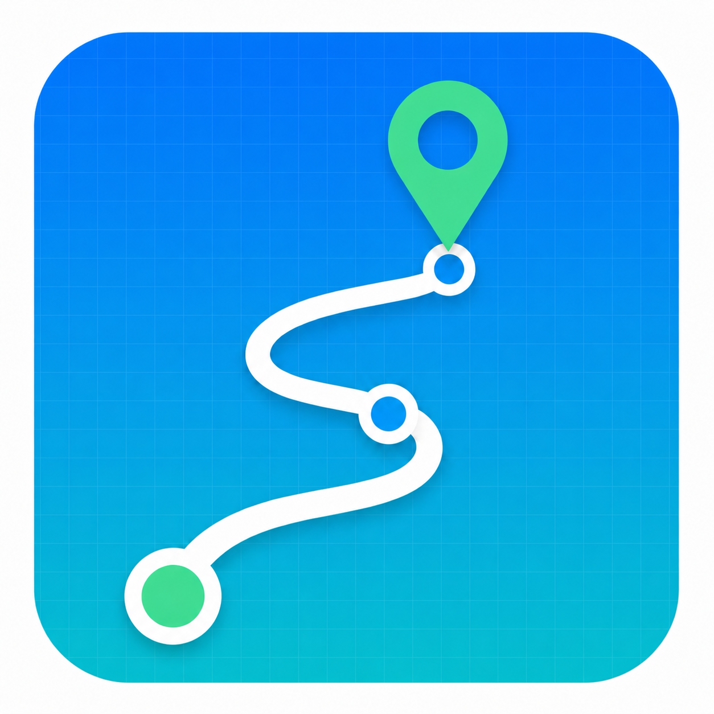
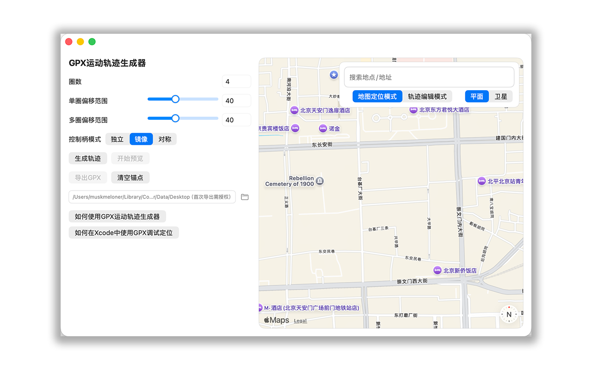
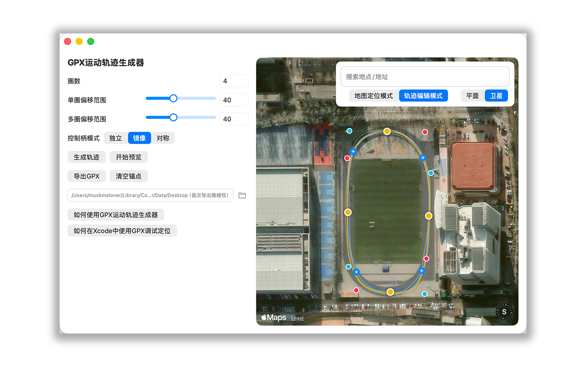
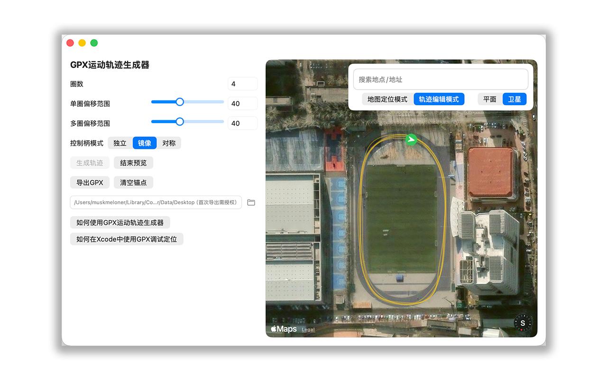

# GPX运动轨迹生成器 / GPX Motion Generator

  

GPX运动轨迹生成器是一款 macOS 应用，用于在地图上绘制运动路线、生成轨迹预览，并导出 GPX 文件。导出的 GPX 文件可用于开发调试流程，例如在 Xcode 中使用 Simulate Location 测试定位相关功能。

GPX Motion Generator is a macOS app for drawing routes on a map, previewing generated movement tracks, and exporting GPX files. The exported GPX files are intended for development and testing workflows, such as using Xcode Simulate Location to test location-based features.

## 功能概览 / Highlights

- 在 Apple 地图上搜索地点并切换平面或卫星视图
- 使用锚点和贝塞尔控制柄绘制路线
- 按圈数、单圈偏移范围和多圈偏移范围生成轨迹
- 预览生成轨迹和移动位置图标
- 使用 macOS 标准保存窗口导出 GPX 文件

English:

- Search locations on Apple Maps and switch between flat and satellite map styles
- Draw routes with anchor points and Bezier handles
- Generate tracks using laps, single-lap offset, and multi-lap offset options
- Preview generated tracks and the moving location marker
- Export GPX files through the standard macOS save dialog

## 应用截图 / Screenshots

<table>
  <tr>
    <td align="center"><strong>地图定位模式</strong></td>
    <td align="center"><strong>轨迹编辑模式</strong></td>
    <td align="center"><strong>轨迹预览</strong></td>
  </tr>
  <tr>
    <td></td>
    <td></td>
    <td></td>
  </tr>
</table>

## 基本使用方式 / Basic Usage

1. 在地图上搜索地点，或手动移动到需要绘制轨迹的位置。
2. 切换到轨迹编辑模式。
3. 点击地图放置锚点，至少添加 3 个锚点形成闭环路线。
4. 拖动锚点和贝塞尔控制柄，调整路线位置和弯道形状。
5. 设置圈数、单圈偏移范围和多圈偏移范围。
6. 点击生成轨迹，并使用预览确认轨迹效果。
7. 点击导出 GPX，通过 macOS 标准保存窗口选择文件名和保存位置。

English:

1. Search for or move to a location on the map.
2. Switch to track editing mode.
3. Click the map to place anchor points. Add at least 3 anchor points to create a closed route.
4. Drag anchor points and Bezier handles to refine the route and curve shape.
5. Set laps, single-lap offset, and multi-lap offset options.
6. Generate and preview the track.
7. Export the GPX file using the standard macOS save dialog.

## 详细教程 / Detailed Guide

详细教程已整合到技术支持页面中，页面内按左右两栏展示“GPX轨迹生成器教程”和“Xcode使用教程”：

The detailed guide is embedded in the support page with two side-by-side sections: one for using the GPX track generator and one for using GPX files in Xcode:

https://meloner423.github.io/GPX-Motion-Generator-Support/support.html#detailed-guides

## 技术支持 / Support

如果你在使用过程中遇到问题，可以通过本仓库的 Issues 页面反馈：

If you encounter any issues while using the app, please report them on the repository Issues page:

https://github.com/Meloner423/GPX-Motion-Generator-Support/issues

When reporting an issue, please include:

- macOS version
- App version
- What you were trying to do
- The steps that caused the problem
- Screenshots if available

## App Store Support URL

如果 GitHub Pages 暂时无法访问，可以直接使用本仓库首页作为 App Store 技术支持网址：

https://github.com/Meloner423/GPX-Motion-Generator-Support

## 应用用途 / App Purpose

本应用只负责生成并导出用户选择保存的 GPX 文件。应用不会连接 iPhone，不会直接修改设备定位，也不会控制第三方 App。

This app only creates GPX files selected and saved by the user. It does not connect to an iPhone, does not modify device location directly, and does not control third-party apps.

## 隐私 / Privacy

GPX运动轨迹生成器不包含账号系统、不包含广告、不包含第三方统计 SDK。用户创建和导出的 GPX 文件只保存在用户选择的位置。

The app does not include accounts, ads, or third-party analytics SDKs. GPX files created by users are saved only to the location selected by the user.

Privacy Policy:

https://github.com/Meloner423/GPX-Motion-Generator-Support/blob/main/privacy.html
